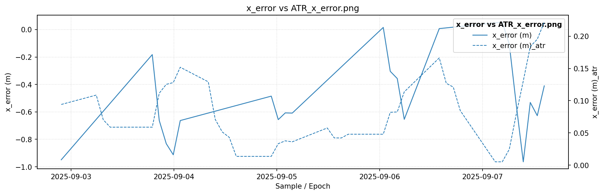
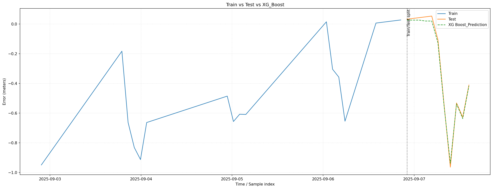
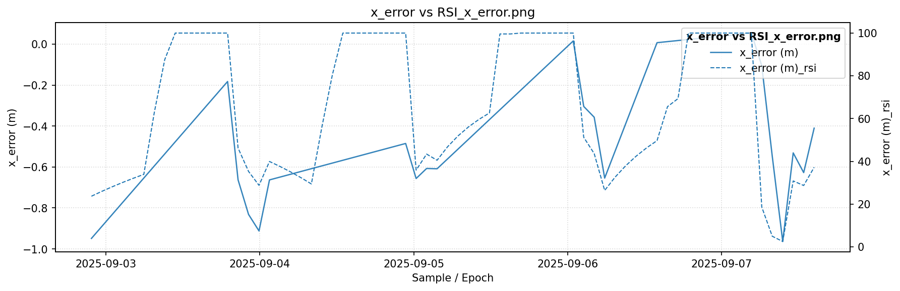
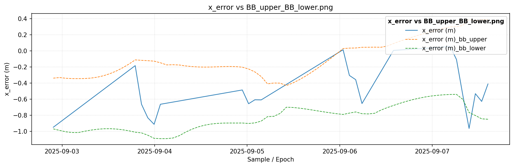
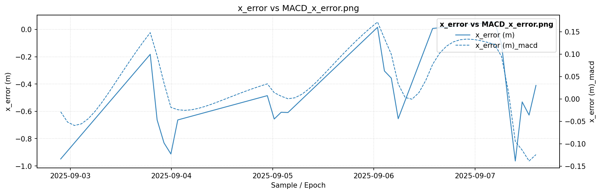
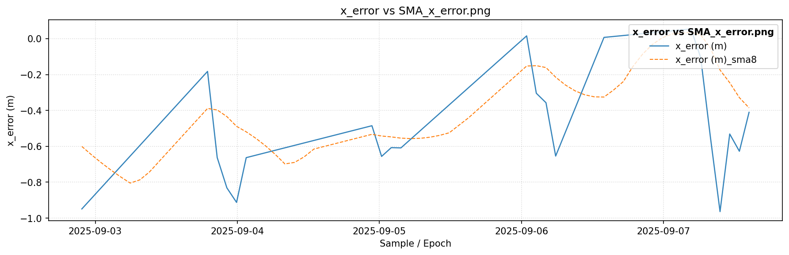
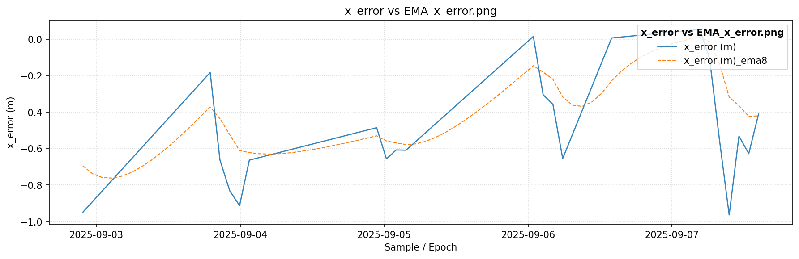

# GNSS Residual Error Forecasting Pipeline

## Project Overview
This project develops an AI/ML pipeline to forecast time-varying residual errors in satellite navigation data, specifically satellite clock and ephemeris parameters affecting GNSS accuracy. The solution smooths and models irregular data using ensemble methods for reliable prediction up to 24 hours ahead.

## Problem Statement
Global Navigation Satellite System (GNSS) residual errors lead to positioning inaccuracies. This project addresses forecasting these residuals' temporal evolution for robust correction, improving navigation reliability.

## Proposed Solution
- **Data Smoothing and Temporal Regularization:** Converts erratic satellite error measurements into uniformly spaced, standardized input.
- **Feature Engineering:** Uses technical indicators like SMA, EMA, ATR, Bollinger Bands, RSI, and MACD to capture trends, momentum, and volatility.
- **Ensemble Modeling:** Employs CatBoost, XGBoost, and LightGBM for multi-output (x, y, z, clock) residual prediction.
- **Evaluation:** Includes RMSE, Whiteness checks, and visual validation for accuracy and noise properties.

## Model Architecture
### Data Pipeline
- Data Ingestion and Cleaning
- Temporal Interpolation for uniformity
- Feature Extraction with advanced indicators
- Train-Test splitting based on time

### Models
- Multioutput regression for residual dimensions
- Ensemble boosting methods for robustness
- Optional LSTM/GRU layers for nonlinear temporal patterns

## Results Visualizations
Below are key model visualizations:

